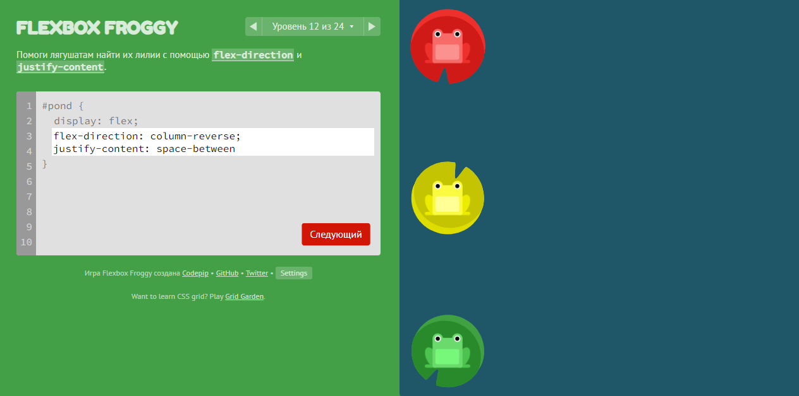
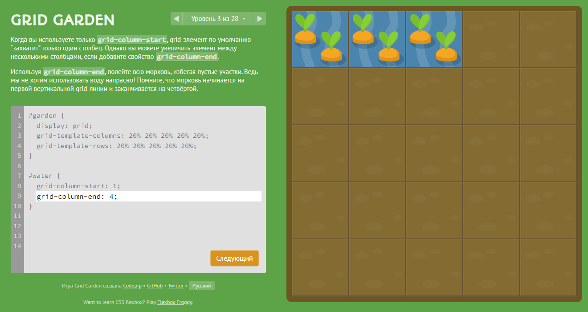
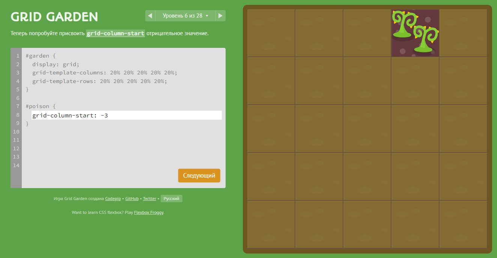
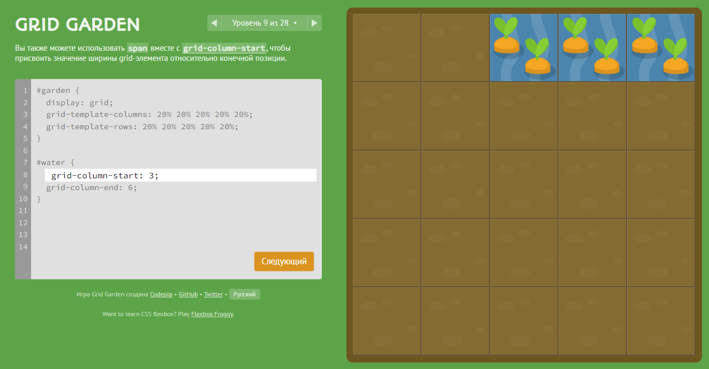

# Hi all. My name is Serhii.
I am a freelancer, designer and starter developer. I love learning, and I hope to get new knowledge here to improve my products. Particular in front-end development, teamwork and new technologies. Good luck to everyone on the course!

## Git Basics

### Introduction to Git and GitHub
- I've used Git before, but only commands like clone, pull, push, commit. Branches and their merging were new to me.
- I was surprised that it is not so difficult as it seemed.
- I'll definitely use separate branches to develop new features

Screenshots

### Learn Git Branching
- I learned new commands rebase, cherry-pick, began to better understand the concept of HEAD.
- I was surprised that there is such convenient interactive program for learning.
- I'll try to use cherry-pick in my work.

Screenshots

## Linux CLI, and HTTP

Screenshots

### Linux Survival
- Until that time, I used a minimum of commands in the terminal (cd, mkdir, ls). Everything else was new and interesting for me.
- To be honest, I did not want to use the terminal in my work, because I thought it would be hard to remember all the commands. It turned out that there are not so many basic commands, and it is not difficult to remember them.
- I'll try to use all of this commands in my work. Maybe I even install Linux or rent a server for practice.

### HTTP Protocol
- I already knew most of the information about HTTP. Reading articles allowed to structure it.
- I was surprised how many headers are used to communicate between server and client.
- I'll read more about headers and try to use them.

## Git Collaboration

Screenshots

### Introduction to Git and GitHub
- There is a lot of information in this part of the course. And fll this was new to me.
- I was surprised how many useful commands Git includes. I'm interested to reading more about the history of Linux and Git.
- I hope that I will use all these commands correctly.

### Learn Git Branching
- Some tasks were difficult for me, but I did it. I got more understanding.
- I was surprised by the flexibility and useful command combinations.
- I can't wait to use it all in real work.

## Intro to HTML and CSS

Screenshots

### Intro to HTML & CSS | Learn HTML | Learn CSS
- I already knew these technologies at this level. But I repeated everything with pleasure.
- I was surprised that the html tag has position relative as default (although it is logical). I thought that all elements have a static position by default.
- I will use all these features.

## Responsive Web Design

Screenshots

### Responsive web design basics | Flexbox | Flexbox Froggy | CSS Grid Layout | Grid Garden 
- I have already worked with these technologies. But I learned a new value "space-evenly".
- I was surprised how many variations these methods have. And I really liked the games.
- I will use Flexbox and Grid Layout in the future.

## HTML-CSS-Popup

- It was a very cool practice! New for me was actually using Git in collaboration with mentor.
- I was pleasantly surprised by the mentor's support. Thanks to @kasionio!
- I experienced great joy after the merge. Moving on to a new challenge!

## JS Basics

Screenshots

- I repeated the basics of JavaScript with pleasure. It was new for me: `import * as` `prop in object` `str.endsWith()` `str.repeat()`.
- I was surprised that I didn't know a great service freeCodeCamp.
- It's still not clear to me how closures can be used in real practice. But I hope to use it soon.